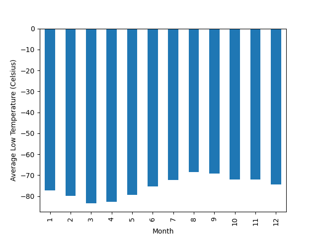

# Web Scraping Data Analysis - Mars Weather and News Stories 

### Repository Overview 
- The script to aggregate each part of the analysis can be found in the folders "mars-news" and "mars-weather"
- Individual image and CSV files for the "mars-weather" analysis can be found in the "output-data" folder

# Mars Weather Analysis

### Mars Weather Analysis Summary 
I analyized my dataset using Panadas to answer the following questions:
- How many months exist on Mars?
- How many Martian (and not Earth) days worth of data exist in the scraped dataset?
- What are the coldest and the warmest months on Mars (at the location of Curiosity)?
- Which months have the lowest and the highest atmospheric pressure on Mars?
- About how many terrestrial (Earth) days exist in a Martian year

### How many months exist on Mars?
There are 12 months on Mars. Month 4 has the highest day count with 194 days and Month 10 has the least amount of days with 112 days. 

### How many Martian (and not Earth) days worth of data exist in the scraped dataset?
In this scraped dataset, there are a total of 1867 Martian days that exist. 

### What are the coldest and the warmest months on Mars (at the location of Curiosity)?
To find this information, I first had to calculate the average low temperature for each month. The month with the lowest average temperature is Month 3 with an average low temperature of -83.907292 degrees Celsius. The month with the warmest average temperature is Month 8 with a average low temperature of -68.382927 degrees Celsiue. 

At Curiosity's location, the results look visually very similar - reference the visualization below

### Which months have the lowest and the highest atmospheric pressure on Mars?

